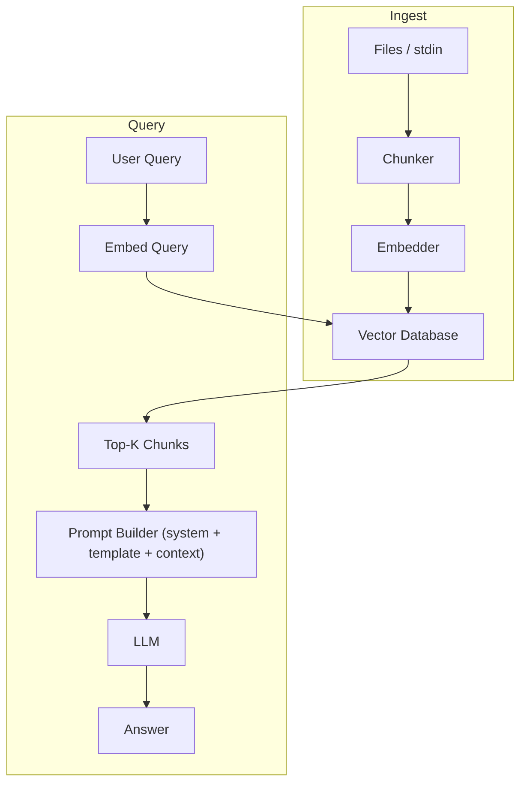
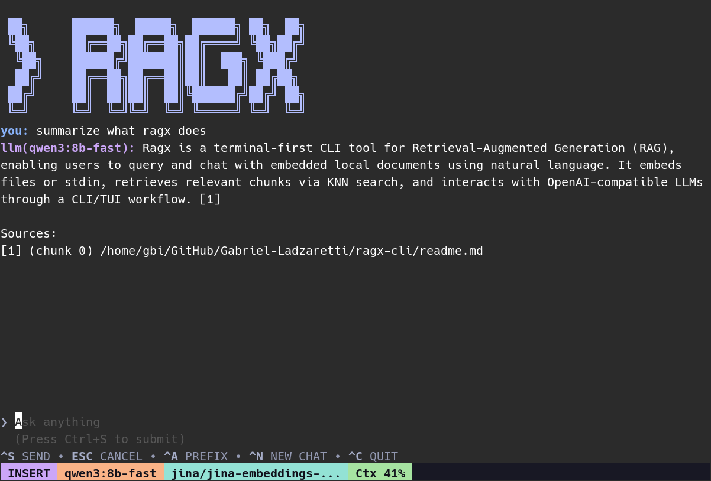

<!-- omit in toc -->
# ragx — a terminal first local RAG assistant


[](https://goreportcard.com/report/github.com/ladzaretti/ragx-cli)


`ragx` is a minimal and hackable **Retrieval-Augmented Generation (RAG)** CLI tool designed for the terminal. It embeds your local files (or stdin), retrieves relevant chunks with KNN search, and queries OpenAI-compatible LLMs (local or remote) via a CLI/TUI workflow.

<details>
<summary>Table of Contents (click to expand)</summary>

- [Why ragx-cli?](#why-ragx-cli)
- [Supported platforms](#supported-platforms)
- [Installation](#installation)
  - [Option 1: Install via Go](#option-1-install-via-go)
  - [Option 2: Install via curl](#option-2-install-via-curl)
  - [Option 3: Download a release](#option-3-download-a-release)
- [Overview](#overview)
  - [Key features](#key-features)
  - [Use cases](#use-cases)
- [Pipeline Overview](#pipeline-overview)
- [Usage](#usage)
- [Configuration file](#configuration-file)
  - [Default prompts](#default-prompts)
  - [Config precedence (highest -\> lowest)](#config-precedence-highest---lowest)
- [Examples](#examples)
  - [Listing available models](#listing-available-models)
  - [TUI session](#tui-session)
  - [CLI one-shot query](#cli-one-shot-query)
  - [Common command patterns](#common-command-patterns)
- [Notes \& Limitation](#notes--limitation)

</details>

## Why ragx-cli?
- **Local first or API backed** – run fully offline with Ollama, or connect to OpenAI/ChatGPT APIs.  
- **Minimal stack** – Go + SQLite-vec + Ollama/OpenAI.  
- **Terminal native** – query via CLI or lightweight TUI.  
- **Configurable** – tweak system/user prompts and RAG parameters (chunk size, overlap, model, etc.).  

## Supported platforms

Binaries are built for:

| OS      | Architectures | Tested on              |
| ------- | ------------- | ---------------------- |
| Linux   | amd64, arm64  | ✅ Fedora 43, Debian 13 |
| macOS   | amd64, arm64  | ❌ not tested           |
| Windows | amd64, arm64  | ❌ not tested           |

>[!IMPORTANT]
> Only Linux has been tested so far. Other platforms are built but unverified, feedback is welcome.


## Installation

### Option 1: Install via Go
```bash
 go install github.com/ladzaretti/ragx-cli/cmd/ragx@latest
```

### Option 2: Install via curl

```bash
curl -sSL https://raw.githubusercontent.com/ladzaretti/ragx-cli/main/install.sh | bash
```
This will auto detect your `OS/arch`, downloads the latest release, and installs `ragx` to `/usr/local/bin`.

### Option 3: Download a release

Visit the [Releases](https://github.com/ladzaretti/ragx-cli/releases) page for a list of available downloads.

## Overview

### Key features

- **OpenAI API `v1` compatible**: point `ragx` at any compatible base URL (local Ollama or remote).
- **Per-provider/per-model overrides**: control temperature and context length.
- **TUI chat**: a lightweight [Bubble Tea](https://github.com/charmbracelet/bubbletea) interface for iterative querying.
- **Terminal first**: pipe text in, embed directories/files, and print results.

### Use cases

- Local knowledge bases: notes, READMEs, docs.
- Quick “ask my files” workflows.

## Pipeline Overview

## Usage
```console
$ ragx --help
{{USAGE}}
```

## Configuration file

The optional configuration file can be generated using `ragx config generate` command:

```toml
{{CONFIG}}
```

### Default prompts
[System Prompt](https://github.com/ladzaretti/ragx-cli/blob/92ff0957b34b5a55a21601ed95a41ef2f9558d57/cli/prompt/prompt.go#L15)

[User Query Template](https://github.com/ladzaretti/ragx-cli/blob/92ff0957b34b5a55a21601ed95a41ef2f9558d57/cli/prompt/prompt.go#L96)


### Config precedence (highest -> lowest)

- CLI flags
- Environment variables (if supported)
  - OpenAI environment variables are auto-detected: `OPENAI_API_BASE`, `OPENAI_API_KEY`
- Config file
- Defaults

## Examples

### Listing available models
```bash
$ ragx list
http://localhost:11434/v1
      jina/jina-embeddings-v2-base-en:latest
      gpt-oss:20b
      qwen3:8b-fast
      nomic-embed-text:latest
      mxbai-embed-large:latest
      llama3.1:8b
      qwen2.5-coder:14b
      deepseek-r1:8b
      qwen3:8b
      nomic-embed-text:v1.5
      hf.co/unsloth/DeepSeek-R1-0528-Qwen3-8B-GGUF:Q4_K_XL
```

### TUI session


### CLI one-shot query
```bash
$ ragx query readme.md \
            --model qwen3:8b \
            --embedding-model jina/jina-embeddings-v2-base-en:latest \
            "how do i tune chunk_size and overlap for large docs?"
- Tune `chunk_size` (chars per chunk) and `overlap` (chars overlapped between chunks) via config or CLI flags. For large documents, increase `chunk_size` (e.g., 2000+ chars) but keep `overlap` < `chunk_size` (e.g., 200). Adjust based on your content type and retrieval needs. [1]

Sources:
[1] (chunk 2) /home/gbi/GitHub/Gabriel-Ladzaretti/ragx-cli/readme.md
```

These are minimal examples to get you started.  
For detailed usage and more examples, run each subcommand with `--help`.

### Common command patterns

> [!NOTE] 
> These examples assume you already have a valid config file with at least one provider, a default chat model, and an embedding model set. 

> [!TIP]
> Generate a starter config with: `ragx config generate > ~/.ragx.toml`.

```shell
  # embed all .go files in current dir and query via --query/-q
  ragx query . -M '\.go$' -q "<query>"

  # embed a single file and provide query after flag terminator --
  ragx query readme.md -- "<query>"

  # embed stdin and provide query as the last positional argument
  cat readme.md | ragx query "<query>"

  # embed multiple paths with filter
  ragx query docs src -M '(?i)\.(md|txt)$' -q "<query>"

  # embed all .go files in current dir and start the TUI
  ragx chat . -M '\.go$'

  # embed multiple paths (markdown and txt) and start the TUI
  ragx chat ./docs ./src -M '(?i)\.(md|txt)$'

  # embed stdin and start the TUI
  cat readme.md | ragx chat
```

## Notes & Limitation

- Chunking is currently character based
  - adjust `chunk_size`/`overlap` for your content and use case.
- The vector database is ephemeral: created fresh per session and not saved to disk.